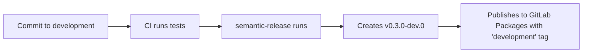
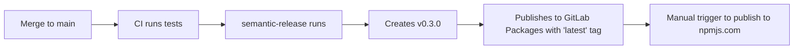

# OSSA Versioning Strategy

## Semantic Versioning with Semantic-Release

OSSA uses **semantic versioning** (semver 2.0.0) with **automated releases** via semantic-release.

### Version Format

```
MAJOR.MINOR.PATCH[-PRERELEASE][+BUILD]
```

Examples:
- `0.3.0` - Stable patch release
- `0.3.0` - Minor feature release
- `1.0.0` - Major release with breaking changes
- `0.3.0-dev.1` - Development pre-release
- `1.0.0-beta.2` - Beta pre-release

---

## Branching Strategy

### Release Branches (`release/v*.*.x`)
- **Purpose**: Active development and testing for a specific minor version
- **Format**: `release/v0.3.x`, `release/v0.4.x`, `release/v1.0.x`, etc.
- **Releases**: Pre-release versions with `-dev` or `-rc` tags
- **Version Detection**: Dynamic from branch name (e.g., `release/v0.3.x` → `v0.3.0-dev`)
- **Example versions**: `v0.3.0-dev`, `v0.3.0-dev1`, `v0.3.0-rc1`, `v0.3.1-dev`
- **Patch Releases**: Automatically detects latest patch version and increments (e.g., `v0.3.1`, `v0.3.2`)

### `main` Branch
- **Purpose**: Stable production releases
- **Releases**: Final semantic versions (no pre-release tag)
- **Version Detection**: From release branch when merged (e.g., `release/v0.3.x` → `main` → `v0.3.0`)
- **Example versions**: `v0.3.0`, `v0.3.0`, `v0.3.1`, `v1.0.0`

---

## Commit Message Convention

OSSA uses **Angular commit message format** for semantic-release:

### Commit Types

| Type | Description | Version Bump | Example |
|------|-------------|--------------|---------|
| `feat` | New feature | MINOR (0.x.0) | `feat: add MCP bridge support` |
| `fix` | Bug fix | PATCH (0.0.x) | `fix: resolve schema validation error` |
| `docs` | Documentation | PATCH* (0.0.x) | `docs: update README with examples` |
| `refactor` | Code refactoring | PATCH (0.0.x) | `refactor: simplify validation service` |
| `perf` | Performance improvement | PATCH (0.0.x) | `perf: optimize schema caching` |
| `test` | Test changes | No release | `test: add kagent bridge tests` |
| `chore` | Maintenance | PATCH* (0.0.x) | `chore(deps): update dependencies` |
| `ci` | CI/CD changes | No release | `ci: add semantic-release job` |
| `build` | Build system | No release | `build: update tsconfig` |
| `style` | Code style | No release | `style: format with prettier` |

\* Only triggers release with specific scopes (e.g., `docs(README)`, `chore(deps)`)

### Breaking Changes

**MAJOR version bump (x.0.0)**

Add `BREAKING CHANGE:` in commit body or footer:

```
feat: redesign agent schema structure

BREAKING CHANGE: Renamed `spec` to `agent` in manifest structure.
Migration guide available at docs/migration-v1.md
```

---

## How Versions are Determined

### Automatic Version Calculation

Semantic-release analyzes commits since the last release:

```
Last release: v0.3.0
New commits:
  - fix: resolve validation error      → PATCH
  - feat: add KAgent bridge support    → MINOR (overrides PATCH)
  - docs: update README                 → No change

Next version: v0.3.0
```

### Development Pre-releases

On `release/v0.3.x` branch:
```
Current: v0.3.0 (latest tag)
Commits: feat, fix, docs
Result: v0.3.0-dev (first dev release)
        v0.3.0-dev1 (second dev release)
        v0.3.0-rc1 (release candidate)
        v0.3.0 (when merged to main)
```

### Patch Releases

Patch releases are automatically detected and incremented:
```
Existing tags: v0.3.0, v0.3.1
New commit on release/v0.3.x
Result: v0.3.2-dev (next patch version)
        v0.3.2 (when merged to main)
```

---

## Release Process

### GitLab Issue-Based Workflow (Recommended)

1. **Create GitLab Issue**:
   - Describe the change (bug fix, feature, etc.)
   - Assign to appropriate milestone
   - Label appropriately (bugfix, feature, chore, etc.)

2. **Create Merge Request from Issue**:
   - Use GitLab's "Create merge request" button from issue page
   - Source branch: `feature/`, `bugfix/`, `chore/`, or `hotfix/` prefix
   - Target branch: `release/v0.3.x` (or current release branch)
   - CI automatically validates MR target

3. **CI/CD Automatically**:
   - Runs tests and validation
   - On merge to `release/v0.3.x`: Creates dev/rc tags (e.g., `v0.3.0-dev`, `v0.3.1-dev`)
   - On merge to `main`: Creates final release tag (e.g., `v0.3.0`, `v0.3.1`)
   - Creates GitLab Release with changelog
   - Version detection is dynamic from branch name

### Dynamic Version Detection

The version detection script (`.gitlab/scripts/detect-version.sh`) automatically:
- Extracts version from release branch name: `release/v0.3.x` → `v0.3.0`
- Detects latest patch version and increments: `v0.3.1`, `v0.3.2`, etc.
- Creates appropriate pre-release tags: `-dev`, `-dev1`, `-rc1`, etc.
- Works for any release branch: `release/v0.3.x`, `release/v0.4.x`, `release/v1.0.x`

### Manual Release (Not Recommended)

Only use for emergency hotfixes:

```bash
npm version patch  # or minor, major
git push --follow-tags
```

---

## Schema Versioning

OSSA schema versions follow specification versions:

```
Package Version  → Schema Directory
-----------------------------------------
v0.2.8          → spec/v0.3.0/
v0.3.0          → spec/v0.3.0/
v1.0.0          → spec/v0.3.0/
```

### Schema Compatibility

- **MAJOR**: Breaking schema changes (incompatible agents)
- **MINOR**: Backward-compatible additions (new optional fields)
- **PATCH**: Bug fixes, clarifications (no schema changes)

---

## Publishing Workflow

### Development Branch



### Main Branch



---

## Version History

| Version | Release Date | Type | Highlights |
|---------|--------------|------|------------|
| 0.3.0 | 2025-10-28 | Patch | Schema fixes, CI improvements |
| 0.3.0 | 2025-10-27 | Minor | Added KAgent bridge, MCP tools |
| 0.1.9 | 2024-XX-XX | Minor | Extensions, taxonomy, observability |
| 0.1.8 | 2024-XX-XX | Minor | Initial stable release |

---

## Configuration Files

### `.releaserc.json`
Semantic-release configuration:
- Commit analysis rules
- Changelog generation
- GitLab release creation
- npm publishing settings

### `.gitlab-ci.yml`
CI/CD pipeline:
- `detect:version` - Dynamic version detection from branch name
- `release:pre-release` - Creates dev/rc tags on release branches
- `release:final` - Creates final release tags on main
- `validate:mr-target` - Ensures MRs target release branches
- `publish:gitlab-packages` - Publishes to GitLab Packages
- `publish:npmjs:manual` - Manual npm publishing

### `.gitlab/scripts/detect-version.sh`
Dynamic version detection script:
- Extracts MAJOR.MINOR from release branch name
- Detects latest patch version from existing tags
- Increments patch version for new releases
- Supports dev and rc pre-release tags
- Works dynamically for any release branch version

---

## FAQ

### Q: How do I create a pre-release?

**A**: Create MR targeting `release/v0.3.x` branch:
1. Create GitLab issue describing the change
2. Create MR from issue targeting `release/v0.3.x`
3. Merge after CI passes
4. CI automatically creates dev tag: `v0.3.0-dev`, `v0.3.1-dev`, etc.

### Q: How do I create a stable release?

**A**: Merge `release/v0.3.x` to `main`:
1. Create MR from `release/v0.3.x` to `main`
2. Ensure all tests pass
3. Merge after approval
4. CI automatically creates final release tag: `v0.3.0`, `v0.3.1`, etc.

### Q: How does patch version detection work?

**A**: The version detection script automatically:
- Scans existing tags for the MAJOR.MINOR version
- Finds the latest patch version (e.g., `v0.3.2`)
- Increments for new release (e.g., `v0.3.3-dev`)
- Works for any release branch dynamically

### Q: How do I force a specific version?

**A**: Use commit message with `BREAKING CHANGE:` for major, or scope for minor:
```bash
# Force major version
git commit -m "feat: new schema format

BREAKING CHANGE: Incompatible with v0.x agents"

# Force minor version
git commit -m "feat: add new optional field"
```

### Q: Can I skip a release?

**A**: Yes, add `[skip ci]` to commit message:
```bash
git commit -m "chore: update docs [skip ci]"
```

### Q: How do I publish to npmjs.com?

**A**: Semantic-release creates the tag and GitLab release. Then manually trigger the `publish:npmjs:manual` job in GitLab CI.

---

## Best Practices

1. ✅ **Always use conventional commits** - Enables automation
2. ✅ **Write clear commit messages** - Appears in CHANGELOG
3. ✅ **One feature per commit** - Easier to track changes
4. ✅ **Test on development first** - Use pre-releases
5. ✅ **Review CHANGELOG** - Before merging to main
6. ❌ **Don't manually edit package.json version** - Let semantic-release handle it
7. ❌ **Don't create tags manually** - Semantic-release does this
8. ❌ **Don't skip tests** - CI must pass for release

---

## Support

- **Documentation**: [docs/](../docs/)
- **Issues**: https://gitlab.com/blueflyio/openstandardagents/issues
- **Releases**: https://gitlab.com/blueflyio/openstandardagents/releases

---

**Last Updated**: 2025-10-28
**Version**: 0.3.0
